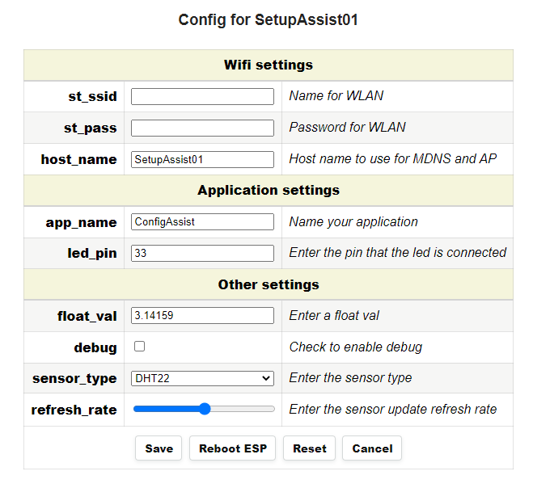
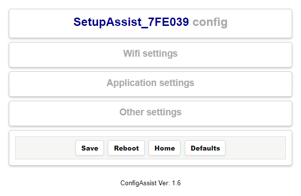

# ConfigAssist

A lightweight library allowing quick configuration of **esp32/esp8266** devices. **Define** application variables using a yaml text and **edit** them with a **responsive** configuration portal. Variables are updated instantly using **async get requests** and saved automatically on a ini file in local storage.

## Description

**ConfigAssist** is a configuration management system for ESP-based devices (ESP32/ESP8266). It provides functionality to manage configuration files, web server operations, and handle user input on the configuration page. The class is versatile and includes support for managing network settings, reading and writing configuration files, and serving HTML forms over a web interface.

**ConfigAssist** will help to automate definition of variables used in a typical **esp32/esp8266** application. It will automatically generate a web portal with edit html elements for each variable based on **yaml definition** text, allowing quick editing is value from a html page.

Application variables like **Wifi ssid**, **Wifi password**, **Host Name** can be quick edited there and will be ready for use in your application. Every time a variable is changed in the web page, it will automatically updated by ConfigAssist using an **async** JavaScript request. As the user leaves or closes the page at end the data are auto saved to the ini file.

## Features

* Automate **variables** definition in a typical ``ESP32/ESP8266`` project using a yaml definition description.
* Configuration **portal** with various **html controls** for editing these variables from a ``web browser``.
* Automatically generate an **ini** file in internal storage and auto save.
* On the fly **update** values in ini file using **ajax** requests.
* **Backup & Restore** device configurations.
* **Wi-Fi scan** support for auto fill nearby Wi-Fi station connections.
* Save **WiFi credentials** to **nvs** to retain ST connections.
* **Validate** Wi-Fi station connections when connecting from AP.
* Auto **synchronize** ESP32/ESP8266 internal **clock** with browser clock.
* Support on the fly **firmware upgrades** (OTA).
* Support automatic firmware **upgrades** over the **internet**.

<p align="center">
  
</p>


## Features description

**ConfigAssist** can perform a **Wifi Scan** on setup and attach a **drop down list** on the field **st_ssid** with nearby available wifi **access points**. The list will be sorted by **signal strength**, with the strongest signals to be placed first and will be refreshed every 15 seconds. Users can choose a valid nearby **ssid** from the wifi list.

**Station** Wifi **connections** can be **validated** during setup with ``Test connection`` link available on each **st_ssid** field. The device will be switched to **WIFI_AP_STA** and **ConfigAssist** will try to test the Station connection with **Wifi ssid**, **Wifi password** entered without disconnecting from the Access Point. If the connection is successful the Station ip address and signal strength will be displayed.

**WiFi credentials** can also be saved to **nvs** to retain ST connections. On **factory defaults** the nvs will be not cleared and the ST connection will be still available.
You can use the command ``http://ip/cfg?_CLEAR=1`` to clear nvs.
Set **CA_USE_PERSIST_CON** to 1 in ``ConfigAssist.h`` to use this feature.

**ConfigAssist** can also check and synchronize the internal **clock** of ESP device with the browser time if needed. So even if no internet connection (AP mode) and no **npt** server is available the device will get the correct time. If **CA_TIMEZONE_KEY** string exists in variables it will be used to set the device time zone string. If not it will use browser offset.

**ConfigAssist** can add web based **OTA** updates to your ESP32/ESP8266 projects. With the button **Upgrade** you can upload a firmware file (*.bin) from you pc and perform a **firmware upgrade** to the device.

**ConfigAssist** can also pefrom **Firmware upgrades** over **internet**. It will compare the currnet firmware version of the device with a remote firmware stored in a **web site** location. If there is a new firmware it will automatically download it and pefrom the upgrade.

Check the <a href="/examples/ConfigAssist-FirmwareCheck/README.txt">FirmwareCheck</a>  example for more details.

These features can be disabled to save memory by setting 1 / 0 the lines **CA_USE_WIFISCAN**, **CA_USE_TESTWIFI**, **CA_USE_TIMESYNC**, **CA_USE_OTAUPLOAD**, and **CA_USE_FIMRMCHECK** in ``ConfigAssist.h``.

You can also use compiler flags to enable / disable theese features
```
build_flags = -DCA_USE_LITTLEFS       ; Use littlefs remove for spiffs
              -DLOGGER_LOG_LEVEL=5
              -DCA_USE_WIFISCAN=1
              -DCA_USE_TESTWIFI=1
              -DCA_USE_TIMESYNC=1
              -DCA_USE_OTAUPLOAD=1
              -DCA_USE_FIMRMCHECK=1
```
Device's configuration ``(*.ini files)`` can be downloaded with the **Backup** button and can be restored later with the **Restore** button.

You can use the command ``http://ip/cfg?_RST=1`` to manually clear the ini file and load defaults.

## Configuration variables

Variables **descriptions** and **default values** are based on a **text description** in yaml format that acts as a template defining the **type**, **label** and extra **info** of each variable.

All config variables must be defined there describing the **variable type**, **default value** and the **label** that will be displayed to the user. It can also include and some **attributes** in case of special variables like **datalist** for list box, min, max, step for **input number** etc.
 ```
Wifi settings:
  - st_ssid:
      label: Name for WLAN
      default: ''
   ```
A simple html page will be generated by **ConfigAssist** allowing quick editing these variables from a web Browser with a connection to the device. While editing the variables they will be **instantly** available to the application and will be automatically saved.

Application variables can be used in code with operator **()** i.e. ```conf('variable')```. The configuration data will be stored in the **SPIFFS** as an **ini file** <em>(Plain Text)</em> and will be automatically loaded on each reboot.

## How it works

On first run when no data (**ini file**) is present in local storage, **ConfigAssist** will start an **Access Point** and load the default yaml dictionary with variable definitions that will be edited. It will then generate an html page with html controls allowing data to be edited from the connected devices.

On each **change** in the html page data will be **updated** and will be available immediately to the application. The data will be saved automatically on local storage when the user finishes editing. If the configuration file is valid during next boot, **yaml dictionary** will not be loaded reducing memory consumption and speeding up the whole process. Note that if data is not changed **ConfigAssist** will not re-save the file.

ConfigAssist uses **c++ vectors** to dynamically allocate and store variables and **binary search** for speeding the access process.

## How to use variables

**ConfigAssist** consists of single file "ConfigAssist.h" that must be included in your application
The application variables can be used directly by accessing the **class** itself by operator **())**
i.e.

+ `String ssid = conf("st_ssid");`
+ `bool debug = conf("debug").toInt();`
+ `int pinNo = conf("st_ssid").toInt();`
+ `digitalWrite(conf("led_buildin").toInt(), 0)`;
+ `float float_value = atof(conf("float_value").c_str());`

Also values can be assigned dynamically with operator **[]**

+ `conf["st_ssid"]  = "TestWifi";`
+ `conf["debug"]  = 1;`
+ `conf["float_value"]  = 12.3;`


## Variables definition with YAML dictionary

In your application sketch file you must define a yaml dictionary that includes all the information needed for the html edit form to be generated. Each variable will be displayed on edit page with the order defined in the yaml file.  See example below...


+ If you use keywords `name, default` an **edit box** will be generated to edit the variable. Add `attribs` keywords to specify min, max, step for a numeric field.
+ If you keyword name ends with ``_pass`` (or ``_pass`` and a number i.e``_pass1``) a **password field** will be used. See **CA_ST_PASSWD_KEY** definition.
+ If you use keyword `checked` instead of `default` a Boolean value will be used that will be edited by a **check box**
+ You can combine keywords `default` with `options` in order to use a select list that will be edited by a **drop list**.
  - The `options` field must contain a comma separated list of values and can be enclosed by single quotes.
  - The `options` field can contains **option names**, **values pairs** delimited with ':' for example 'AllOpen':'0', 'AllClosed':'1' etc.

+ You can combine keywords `default` with `range` in order to use a value that will be edited by a **input range**.
  - The `range` field must contain a comma separated list of `min, max, step` and can be enclosed by single quotes.
+ You can combine keywords `default` with `datalist` in order to use a value that will be edited by a **combo box**.
  - The `datalist` field must contain a comma or line feed separated list of default values for drop down list.
+ You can combine keywords `default` with `file` in order to use a small text be edited by a **text area**.
  - The `file` field must contain a valid file path that the text will be saved to. The `default` keyword can also be used to define a default value.

+ All vars can have the keyword `attribs` to specify special attributes like javaScript, style for this field.
  - For example `attribs: onChange = "this.style.color = 'red'"; `
  - You can use `setSubScript` function to add an init java script to main page.

  Check <a href="examples/ConfigAssist-VarAttributes/">ConfigAssist-VarAttributes</a> in ``examples/`` folder for more details.


A **separator title** can also be used to group configuration values under a specific title.
<p align="center">
  
</p>

Seperators can be opened and closed when click on their title. You can define the initial state by using **setDisplayType** function.

 Use **AllOpen** to display opened tabs, **AllClosed** to display seperator titles only and **Accordion** to close all but not current tab.
  ```
  // Set the display type
  conf.setDisplayType(ConfigAssistDisplayType::Accordion);
  ```

Version 2.7.8 now uses yaml instead of json descriptions to save space and increase speed
See <a href="https://github.com/powof2/direct-yaml">direct-yaml</a> for details.

If you want to convert your existing configuration from JSON to YAML
download version

<a href="https://github.com/gemi254/ConfigAssist-ESP32-ESP8266/releases/tag/2.7.8">ConfigAssist v2.7.8</a>

comment at ConfigAssist.h line 7
```
#define CA_USE_YAML   // Comment to use JSON
```
Compile the JSON version and add a yaml dump handler.
```
  server.on("/yaml", []() {           // Append yaml dump handler
    conf.dumpYaml(&server);
  });
```
Upload and visit ``http://ip/yaml`` to copy your configuration in yaml format.

## Sample variables definition text
```
const char* VARIABLES_DEF_YAML PROGMEM = R"~(
Wifi settings:
  - st_ssid:
      label: Name for WLAN
      default: ''
  - st_pass:
      label: Password for WLAN
      default: ''
  - host_name:
      label: >-
        Host name to use for MDNS and AP<br>{mac} will be replaced with device's mac
        id
      default: configAssist_{mac}

Application settings:
  - app_name:
      label: Name your application
      default: ConfigAssistDemo
  - led_buildin:
      label: Enter the pin that the build in led is connected. Leave blank for auto.
      attribs: "min='2' max='23' step='1'"
      default: 2

ConfigAssist settings:
  - display_style:
      label: Choose how the config sections are displayed. Must reboot to apply
      options:
        - AllOpen: 0
        - AllClosed: 1
        - Accordion : 2
        - AccordionToggleClosed : 3
      default: AccordionToggleClosed

Other settings:
  - float_val:
      label: Enter a float val
      default: 3.14159
      attribs: min="2.0" max="5" step=".001"
  - debug:
      label: Check to enable debug
      checked: False
  - sensor_type:
      label: Enter the sensor type
      options: 'BMP280', 'DHT12', 'DHT21', 'DHT22'
      default: DHT22
  - refresh_rate:
      label: Enter the sensor update refresh rate
      range: 10, 50, 1
      default: 30
  - time_zone:
      label: Needs to be a valid time zone string
      default: EET-2EEST,M3.5.0/3,M10.5.0/4
      datalist:
        - Etc/GMT,GMT0
        - Etc/GMT-0,GMT0
        - Etc/GMT-1,<+01>-1
  - cal_data:
      label: Enter data for 2 Point calibration.</br>Data will be saved to /calibration.ini
      file: "/calibration.ini"
      default:
        X1=222, Y1=1.22
        X2=900, Y2=3.24
)~";
```

## Project definitions in your main app

+ include the **ConfigAssist**  class
  - `#include <ConfigAssist.h>  //ConfigAssist class`

+ Define your static instance with **defaults**
  - `ConfigAssist conf;`

+ if you want to use a different external **ini file name**
  - `ConfigAssist conf(INI_FILE);`

+ if you want to use a different external **ini file name** and **yaml description**
  - `ConfigAssist conf(INI_FILE, VARIABLES_DEF_YAML);  // ConfigAssist with custom name & dictionary`

+ if you want to use a different external **ini file name** and **yaml description** disabled
  - `ConfigAssist conf(INI_FILE, NULL);  // ConfigAssist with custom ini name & dictionary disabled`

## Call back functions
You can define a call back function wich will be called when the portal changes a value.
This function will be called each time a value is changed from the portal with the value name as a parameter.
```

// Will be called when portal is updating a key
void onDataChanged(String key){
  LOG_I("Data changed, key:%s, val: %s \n", key.c_str(), conf(key).c_str());
}

// Setup call back function
conf.setRemotUpdateCallback(onDataChanged);

```

## WIFI Access point handlers

**ConfigAssist** must be initialized with a pointer to a web server to automatically handle AP form requests.
Setup will add web handlers /cfg, /scan, to the server and if apEnable = true will enable Access Point.
```
conf.setup(server, /*Start AP*/ true);
or
conf.setupConfigPortal(server, true);
```
You can add /cfg handler to your application after connecting the device to the internet.
Editing config will be enabled for station users.

```
// ConfigAssist will register handlers to the web server
// so config can be edited.
conf.setupConfigPortalHandlers(server);
```
## Connect the WiFi using **ConfigAsistHelper**
In order to simplify the proccess of connect to WiFi and set static ip address use the **ConfigAsistHelper class**. It will connect the WiFi using credentials contained in a ConfigAssist class. It will search for variables ending with **CA_ST_SSID_KEY** for ssid and **CA_ST_PASSWD_KEY** for passwords.
  For example variables like..
  ```
  st_ssid,  st_pass,
  station_ssid, station_pass
  ```
  It can also use variables like..
  ```
  st_ssid1, st_pass1,
  st_ssid2, st_pass2
  ```
  for failover connections.

  If a variable found ending with **CA_ST_STATICIP_KEY** it will automatically set static ip.

  To use **ConfigAsistHelper**
  ```
  // Define a ConfigAssist helper class with a ConfigAssist conf
  // containig credentials
  ConfigAssistHelper confHelper(conf);
  ```

  ```
  // Connect to any available network
  // Wait for connection or TimeOut
  bool bConn = confHelper.connectToNetwork(15000 /*Timeout ms*/, conf("led_buildin").toInt() /*Key containig internal led*/);
  ```

  ```
  // Connect to any available network async
  // It will not wait to connect but will send a connection result
  // Set Wi-Fi credentials from config and start connection process
  confHelper.connectToNetworkAsync(15000, 13, [](ConfigAssistHelper::WiFiResult result, const String& msg) {
      switch (result) {
          case ConfigAssistHelper::WiFiResult::SUCCESS:
              LOG_D("Connected to Wi-Fi! IP: %s\n", msg.c_str());
              break;

          case ConfigAssistHelper::WiFiResult::INVALID_CREDENTIALS:
              LOG_D("Invalid credentials: %s\n", msg.c_str());
              break;

          case ConfigAssistHelper::WiFiResult::CONNECTION_TIMEOUT:
              LOG_D("Connection fail: %s\n", msg.c_str());
              break;

          case ConfigAssistHelper::WiFiResult::DISCONNECTION_ERROR:
              LOG_D("Disconnect: %s\n", msg.c_str());
              break;

          default:
              LOG_D("Unknown result: %s\n", msg.c_str());
              break;
      }
  });
  ```

## Synchronize time using **ConfigAsistHelper**
ConfigAssist can synchronize device's time with a ntp server using **ConfigAsistHelper**.
Variables ending with **CA_NTPSYNC_KEY** for example  **ntp_server1**, **ntp_server2**, **ntp_server3**
will be used as ntp servers.
The current timezone for the device will be set automatically using **CA_TIMEZONE_KEY** for example **time_zone**

Just define **ntp_server1**, **ntp_server2**, **ntp_server3** and **time_zone** settings in your config and call **syncTime** with timeout ms to wait until time is synchronized. Use force = true to reset clock and wait the time to be synchronized.
```
- ntp_server1:
      label: Time server to sync time1
      default: "europe.pool.ntp.org"
  - ntp_server2:
      label: Time server to sync time2
      default: "time.windows.com"
  - ntp_server3:
      label: Time server to sync time3
      default: "pool.ntp.org"

  // Setup time synchronization
  // Wait max 10 sec for sync
  confHelper.syncTime(10000);

  // Force time synchronization,
  // Clock will be reseted and wait for max 20 sec to sync
  // If fail clock will be restored
  confHelper.syncTime(20000, true);
  or
  // Sync time, force to reset clock, async to not wait for sync
  // In asynchronous mode, if time synchronization fails, no restoration of the clock occurs.
  confHelper.syncTimeAsync(20000, true);

  ```

## Setup function
```
void setup()

  // Setup led on empty string
  if(conf("led_buildin")=="") conf.put("led_buildin", LED_BUILTIN);
  // Or
  if(conf("led_buildin")=="") conf["led_buildin"] = LED_BUILTIN;

  // Connect to any available network with timeout 1500 and led pin on led_buildin variable
  bool bConn = confHelper.connectToNetwork(15000, conf("led_buildin").toInt());

  // Append config assist handlers to web server, setup ap on no connection
  conf.setup(server, !bConn);
  if(!bConn) LOG_E("Connect failed.\n");

  ```

## Ini files
**ConfigAssist** can also used to quick generate and store ini files.
Just call the class constructor with a filename to be saved and null to disable dictionary.
```
ConfigAssist info("/info.ini", NULL);
```
and add the parameters to be stored with
```
info.put("var1", "test1", true);
or
info["var1"] = "test1";

info.saveConfigFile();
```

## Logging to a file
**ConfigAssist** can redirect serial print functions to a file in a spiffs and a **Debug log** can be generated.
In your application you use **LOG_E**, **LOG_W**, **LOG_I**, **LOG_D** macros instead of **Serial.prinf**
to print your messages. **ConfigAssist** can record these messages with **timestamps** to a file.

+ define **ConfigAssist**  log mode
  Define the log level (Error = 1 .. Verbose = 5)
  ```
  #define LOGGER_LOG_LEVEL 5 // Errors & Warnings & Info & Debug & Verbose
  ```

+ if you want to enable serial print to a log file use..
  ```
  //Enable ConfigAssist logging to file
  #define LOGGER_LOG_MODE  2 // Log to file

  //Define the log filename
  #define LOGGER_LOG_FILENAME "/log1"
  ```

 + You can also use your own log_printf function by setting log mode to 3
    ```
    #define LOGGER_LOG_MODE  3        // External log_printf function
    ```

 Check <a href="examples/ConfigAssist-LogExternal/">ConfigAssist-LogExternal</a> in ``examples/`` folder.

## Compile
Download library files and place them on ./libraries directory under ArduinoProjects
Then include the **ConfigAssist.h** in your application and compile..

+ compile for arduino-esp3 or arduino-esp8266.
+ To use Persistent ST connections On ESP8266 devices you must install **Preferences** library to provide ESP32-compatible Preferences API using LittleFS
+ if your variables exceed **CA_MAX_PARAMS** increase this value in class header.

You can remove old **ini** config file by calling `conf.deleteConfig();` in your setup function.
See **ConfigAssist-ESP32-ESP8266.ino** line:210

###### If you get compilation errors on arduino-esp32 you need to update your arduino-esp32 library in the IDE using Boards Manager

## Other examples
You can see an advanced example of **ConfigAssist** usage on <a target="_blank" title="PlantStatus LilyGO TTGO Higrow" href="https://github.com/gemi254/PlantStatus-LilyGO-TTGO-Higrow">**PlantStatus**</a> a plant monitoring and logging application
