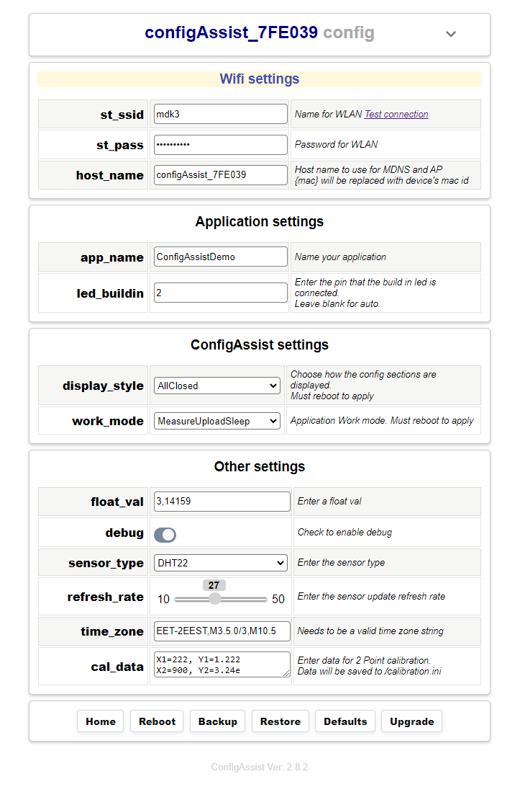

# ConfigAssist
A lightweight library allowing quick configuration for **esp32/esp8266** devices by editing application variables using a configuration portal and a json definition dictionary and saving them on a ini file in local storage.
<p align="center">
  
</p>

## Description
**ConfigAssist** will automatically generate a web form that allows editing of application preferences such as **Wifi ssid**, **Wifi password**. 
A json description text, with a `variable name`, a `default value` and a `label` for each variable must be defined describing all the variables that the application will use. 

A simple html page with an edit form will automatically generated by **ConfigAssist** allowing editing of these variables from a web 
Browser. After editing, application variables can be used with operator **[]** i.e. ```conf['variable']```.
The configuration data will be stored in the **SPIFFS** as an **ini file** <em>(Plain Text)</em> and will be 
loaded on each reboot.

## How it works
On first run when no data (ini file) is present in local **storage**, **ConfigAssist** will start an **AccessPoint** and load the
default json dictionary with variables to be edited. A web form will be generated in order to 
initialize application variables using a **web page** from the remote host connected to AccesPoint.
Data will be saved on local storage and will be available on next reboot. If configuration file is valid during next boot the **json dictionary** will not be loaded reducing memory consumption and speeding up the whole process.

ConfigAssist uses **c++ vectors** to dynamically allocate and store variables and **binary search** for speeding the access process.

## How to use variables
**ConfigAssist** consists of single file "configAssist.h" that must be included in your application 
The application variables can be used directly by accessing the **class** itself by operator **[]**
i.e.

+ `String ssid = conf["st_ssid"];`
+ `int pinNo = conf["st_ssid"].toInt();`
+ `digitalWrite(conf["led_pin"].toInt(), 0)`;
+ `float float_value = atof(conf["float_value"].c_str());`

## Variables definition with JSON dictionary
In your application sketch file you must define a json dictionary that includes all the information needed 
for the html form to be generated. See example below. Each variable will be displayed on edit page with the order 
defined in the json file. 
+ if you use keywords `name, default` an **edit box** will be generated to edit the variable.
+ If you use keyword `checked` instead of `default` in order to use a Boolean value that will be edited by a **check box**
+ You can compine keywords `default` with `options` in order to use a select list that will be edited by a **drop list**. 
  - The `options` field must contain a comma seperated list of values and can be enclosed by single quotes.
+ You can compine keywords `default` with `range` in order to use a value that will be edited by a **input range**. 
  - The `range` field must contain a comma seperated list of `min, max, step` and can be enclosed by single quotes.
  

A **separator title** can also be used to group configuration values under a specific title.
```
const char* appConfigDict_json PROGMEM = R"~(
[{
 "seperator": "Wifi settings"
  },{
      "name": "st_ssid",
     "label": "Name for WLAN (Ssid to connect)",
   "default": ""
  },{
      "name": "st_pass",
     "label": "Password for WLAN",
   "default": ""
  },{
 "seperator": "Application settings"
  },{
      "name": "host_name",
     "label": "Host name to use for MDNS and AP",
   "default": "ConfigAssist"
 },{
      "name": "debug",
     "label": "Check to enable debug",
   "checked": "False"
 },{
      "name": "sensor_type",
     "label": "Enter the sensor type",
   "options": "'BMP280', 'DHT12', 'DHT21', 'DHT22'",
   "default": "DHT22"
 },{
      "name": "refresh_rate",
     "label": "Enter the sensor update refresh rate",
     "range": "10, 50, 1",
   "default": "30"   
```

## Project definitions in your main app

+ include the **configAssist**  class
  - `#include "configAssist.h"  // Setup assistant class`

+ Define your static instance
  - `ConfigAssist conf;        //ConfigAssist class`

+ in your setup function you must init the config class with a pointer to the dictionary
  - `conf.init(appConfigDict_json);` or `onf.init(NULL);` for default settings
+ if you want to use a different external **ini file name**
  - `conf.init(appConfigDict_json, ini_file_name);`
 
## WIFI Access point handler
Define a web server handler function for the **configAssist** class. This function will be passed to 
conf.setup() in order for configAssist to automatically handle AP form requests
```
// Handler function for AP config form
static void handleAssistRoot() { 
  conf.handleFormRequest(&server); 
}
```
## Setup function
```
void setup()
  // Must have storage to read from
  STORAGE.begin(true);
  
 //Initialize config with application's json dictionary
 conf.init(appConfigDict_json);  

  //Failed to load config or ssid empty
  if(!conf.valid() || conf["st_ssid"]=="" ){ 
    //Start Access point server and edit config
    //Will reboot for saved data to be loaded
    conf.setup(server, handleAssistRoot);
    return;
  }
  ...
  ```

## Compile
Download the files **configAssist.h** and **configAssistPMem.h** and put it in the same directory
as your **sketch foler**. Then include the **configAssist,h** in your application and compile..

+ compile for arduino-esp3 or arduino-esp8266.
+ In order to compile you must install **ArduinoJson** library.
+ if your variables exceed **MAX_PARAMS** increase this value in class header.

###### If you get compilation errors on arduino-esp32 you need to update your arduino-esp32 library in the IDE using Boards Manager
